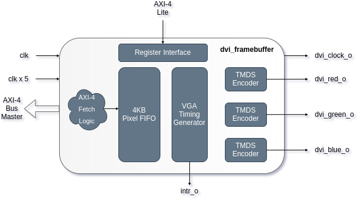

### Minimal DVI / HDMI Framebuffer

Github:   [https://github.com/ultraembedded/core_dvi_framebuffer](https://github.com/ultraembedded/core_dvi_framebuffer)

This component allows the addition of a DVI/HDMI output to your FPGA project.  
The IP fetches pixel data from an external AXI-4 memory target and converts to a TMDS suitable for driving DVI or HDMI (DVI mode) outputs from a FPGA.



Based around [Mike Field's](https://github.com/hamsternz) TMDS encoder code.

#### Features

* HDMI / DVI TMDS output.
* RGB565 input format.
* AXI-4 bus master with burst support.
* 4KB pixel data prefetch FIFO (which map to BlockRAMs in Xilinx FPGAs).
* AXI-4 Lite register interface with programmable framebuffer fetch address, enable, interrupt control.
* Start of frame interrupt output.
* Configurable display resolution (640x480, 800x600, 1280x720, 1920x1080).
* Works with the Linux 'simple-framebuffer' driver.

#### Interfaces

| Name          | Description                                                           |
| ------------- | --------------------------------------------------------------------- |
| clk_i         | Clock input - must be suitable for the configured res/refresh rate.   |
| clk_x5_i      | Clock input x 5.                                                      |
| rst_i         | Async reset, active-high.                                             |
| cfg_*         | AXI-4 Lite configuration port (optional if VIDEO_ENABLE=1).           |
| outport_*     | AXI4 master interface for pixel fetch data.                           |
| intr_o        | Active high interrupt output (single cycle strobe).                   |

#### Params

| Name          | Default     | Description                                                    |
| ------------- | ----------- | -------------------------------------------------------------- |
| VIDEO_WIDTH   | 800         | Display resolution (H).                                        |
| VIDEO_HEIGHT  | 600         | Display resolution (V).                                        |
| VIDEO_REFRESH | 72          | Display refresh rate.                                          |
| VIDEO_ENABLE  | 1           | Pixel fetch enable after reset (changeable via AXI-4L regif).  |
| VIDEO_FB_RAM  | 32'h3000000 | Framebuffer base address (changeable via AXI-4L regif).        |

#### Linux Framebuffer

Example Linux DTS configuration with the framebuffer located @ 0x300_0000 and 800x600 display resolution;
```
    framebuffer {
      compatible = "simple-framebuffer";
      reg = <0x3000000 (800 * 600 * 2)>;
      width = <800>;
      height = <600>;
      stride = <(800 * 2)>;
      format = "r5g6b5";
    }; 
```

#### Testing
Tested on a Xilinx Artix 7 (Digilent Arty A7) with Dell U2515 monitor and a LG LCD TV with various resolutions.
Used with the Linux Kernel 'simple-framebuffer' driver.

#### References
* [TMDS Encoding](https://en.wikipedia.org/wiki/Transition-minimized_differential_signaling)
* [DVI Interface](https://en.wikipedia.org/wiki/Digital_Visual_Interface)

